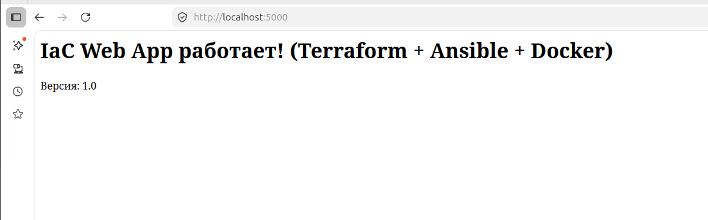
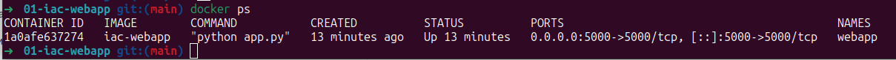

# 01 — IaC Web-приложение (Terraform + Ansible + Docker)

**Полный цикл Infrastructure as Code** для простого веб-приложения.

### Технологии
- Terraform (Yandex Cloud)
- Ansible (конфигурация сервера)
- Docker + Dockerfile
- GitLab CI/CD

### Как запустить локально
```bash
cd app
docker build -t iac-webapp .
docker run -d -p 5000:5000 --name webapp iac-webapp
```

Приложение будет доступно по адресу: http://localhost:5000

### Скриншоты

Веб-приложение в работе


Веб-приложение успешно запущено

Docker ps


Контейнер работает, порт 5000 проброшен