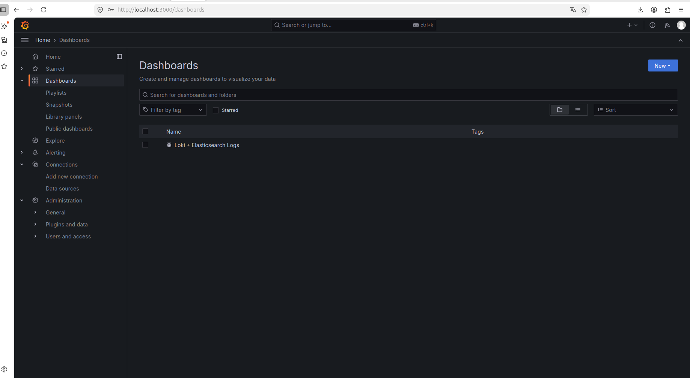
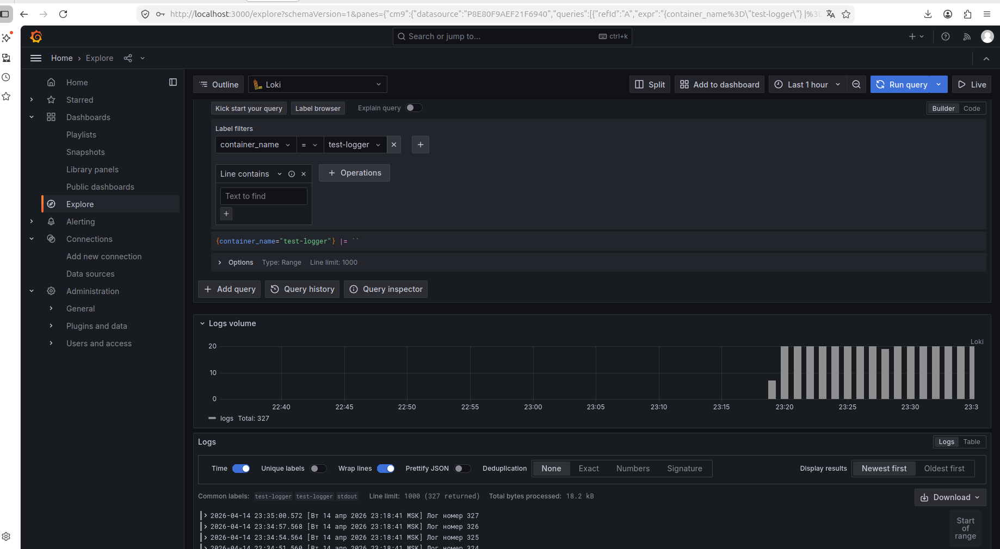
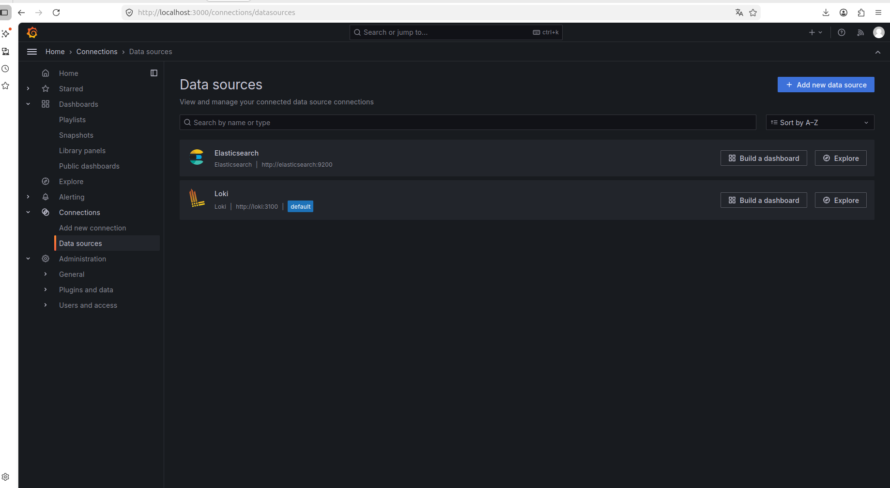
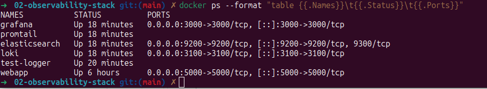

# 02 — Observability Stack (Grafana + Loki + Promtail + Elasticsearch)

**Полный стек мониторинга и сбора логов** для микросервисной архитектуры.

### Технологии
- Grafana (визуализация)
- Loki (сбор и хранение логов)
- Promtail (агент сбора логов)
- Elasticsearch (поиск и аналитика)
- Docker Compose

### Как запустить локально

```bash
Запуск всего стека
docker compose up -d

Проверка статуса контейнеров
docker ps --format "table {{.Names}}\t{{.Status}}\t{{.Ports}}"
```

Grafana будет доступна по адресу: http://localhost:3000
Логин: admin | Пароль: admin

Loki API: http://localhost:3100
Elasticsearch: http://localhost:9200
### Генерация тестовых логов

```bash

docker run --rm --name test-logger \
  -d --label logging=promtail \
  busybox sh -c "i=1; while true; do echo \"[$(date)] Лог номер \$i\"; i=\$((i+1)); sleep 3; done"
```

Скриншоты
Дашборд «Loki + Elasticsearch Logs»


Дашборд с визуализацией логов и метрик
Explore — просмотр логов Loki


*Фильтр container_name="test-logger" — 327 логов успешно отображаются*
Источник данных Loki в Grafana


Подключение к Loki успешно (зелёный статус Working)
Запущенные контейнеры Docker


*Все 5 контейнеров работают: grafana, loki, promtail, elasticsearch, test-logger*