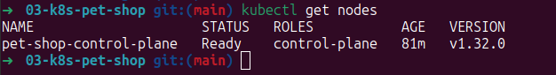
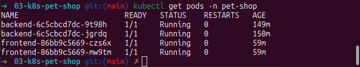
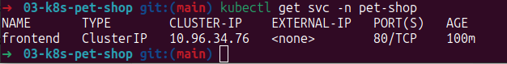
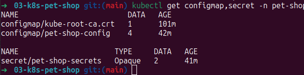
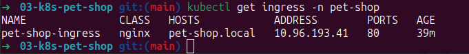
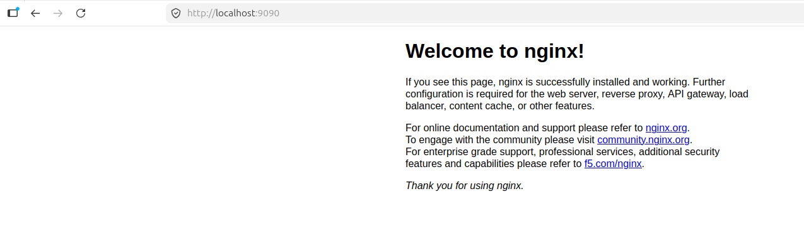

# 03 — Kubernetes Microservices (Pet-Shop)

**Production-ready Kubernetes кластер** для микросервисного приложения интернет-магазина товаров для животных.

### Технологии
- **Kubernetes (Kind)** — оркестрация контейнеров
- **NGINX Ingress Controller** — маршрутизация трафика
- **kubectl** — управление кластером
- **Docker** — контейнеризация
- **Terraform** — Infrastructure as Code

### Как запустить локально

```bash
Создание Kubernetes кластера
kind create cluster --name pet-shop --config terraform/kind-config.yaml

Деплой всех манифестов
kubectl apply -f k8s/

Установка Ingress Controller
kubectl apply -f https://raw.githubusercontent.com/kubernetes/ingress-nginx/controller-v1.10.0/deploy/static/provider/cloud/deploy.yaml

Проверка статуса
kubectl get pods -n pet-shop
kubectl get ingress -n pet-shop

Доступ к приложению
bash

Port-forward для локального доступа
kubectl port-forward svc/frontend -n pet-shop 9090:80
```

Приложение будет доступно по адресу: http://localhost:9090

Примечание: в демонстрационных целях используются образы nginx:alpine
Проверка работоспособности
```bash

Состояние кластера
kubectl get nodes

Все ресурсы в namespace pet-shop
kubectl get all -n pet-shop

Конфигурация и секреты
kubectl get configmap,secret -n pet-shop

Просмотр логов
kubectl logs -f -n pet-shop -l app=frontend
```

Скриншоты

Состояние кластера


Control-plane нода в статусе Ready

Запущенные поды


Сервисы


Frontend ClusterIP сервис для внутренней маршрутизации

ConfigMap и Secrets


ConfigMap с 4 параметрами и Secret с 2 зашифрованными значениями

Ingress правила


*NGINX Ingress с маршрутизацией pet-shop.local → frontend:80*

Веб-интерфейс приложения


Welcome to nginx! — приложение успешно развернуто

Реализованные возможности:

*High Availability — 2+ реплики каждого сервиса
*elf-healing — liveness/readiness probes
*Zero-downtime deployments — RollingUpdate стратегия
*Configuration as Code — ConfigMap для настроек
*Secrets management — шифрование sensitive данных
*Traffic routing — Ingress Controller с маршрутизацией
*Resource management — limits/requests для контейнеров