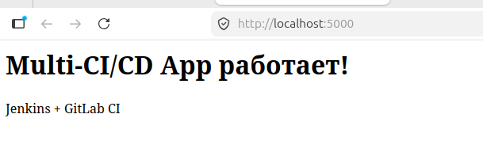
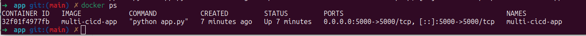
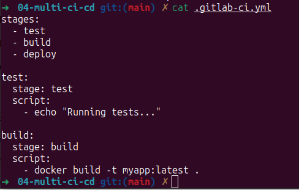
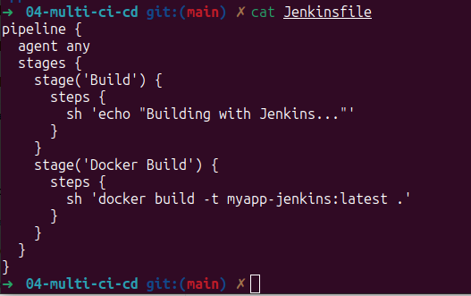

# 04 — Multi-CI/CD: Jenkins + GitLab CI

**Демонстрация работы с двумя CI/CD системами** для одного приложения.

### Технологии
- **Jenkins** — CI/CD сервер
- **GitLab CI** — CI/CD пайплайны
- **Docker** — контейнеризация
- **Flask (Python)** — тестовое приложение

### Как запустить локально

```bash
Переходим в папку с приложением
cd app

Собираем Docker-образ
docker build -t multi-cicd-app .

Запускаем контейнер
docker run -d -p 5000:5000 --name multi-cicd-app multi-cicd-app

Проверка работоспособности

Проверяем, что контейнер запущен
docker ps

Смотрим логи
docker logs multi-cicd-app
```

Приложение будет доступно по адресу: http://localhost:5000

Скриншоты

- **Веб-интерфейс приложения**


Flask приложение с сообщением "Multi-CI/CD App работает!"

- **Запущенный Docker-контейнер**


Контейнер multi-cicd-app в статусе Up

- **GitLab CI конфигурация**


Три стадии: test, build, deploy

- **Jenkins Pipeline**


Pipeline с этапами Build и Docker Build

*Что можно улучшить?*

- Добавить unit-тесты в пайплайны

- Настроить автоматический деплой в Kubernetes

- Добавить статический анализ кода

- Настроить уведомления (Telegram/Slack)