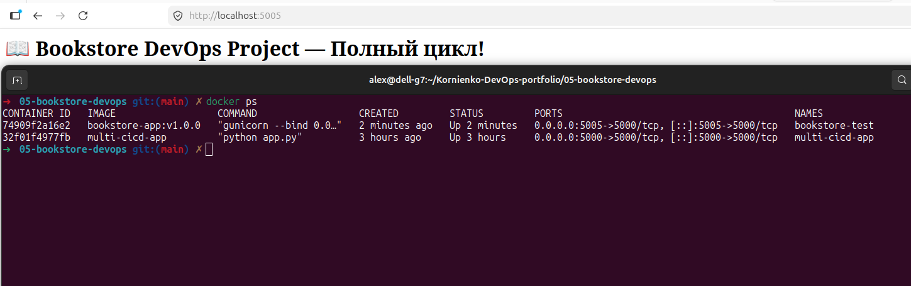
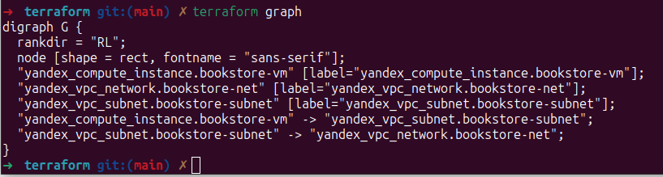
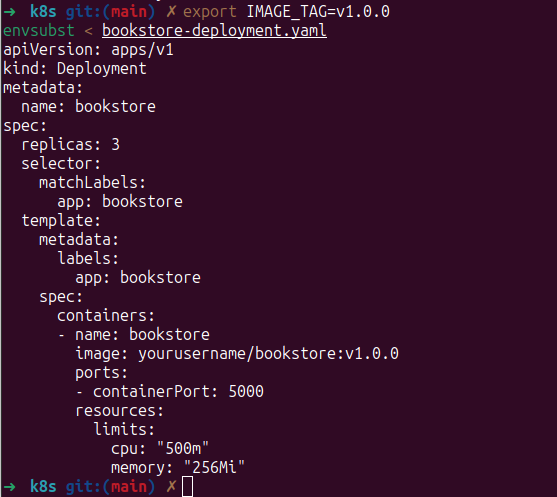

#  05 — Bookstore DevOps: Terraform + K8s + Monitoring

*Комплексный проект по развертыванию инфраструктуры и приложения с настроенным мониторингом и динамическим деплоем.*

- **Технологии:**

- **Terraform** — IaC для Yandex Cloud

- **Kubernetes** — оркестрация контейнеров

- **Prometheus + Loki + Grafana** — мониторинг и логирование (PLG Stack)

- **Docker** — контейнеризация

- **Flask (Python)** — веб-приложение

Как запустить локально
```
Переходим в папку с terraform и проверяем конфигурацию
cd terraform
terraform validate

Сборка Docker-образа приложения
cd ../app
docker build -t bookstore-app:v1.0.0 .

Запуск контейнера на порту 5005
docker run -d -p 5005:5000 --name bookstore-test bookstore-app:v1.0.0

Проверка работоспособности

роверяем, что контейнер запущен
docker ps

Проверка подстановки тега для K8s
cd ../k8s
export IMAGE_TAG=v1.0.0
envsubst < bookstore-deployment.yaml
```

Приложение будет доступно по адресу: http://localhost:5005

- **Скриншоты**

Веб-интерфейс приложения



Flask приложение "Bookstore DevOps Project — Полный цикл!" и работающий контейнер в терминале.

Инфраструктура в Yandex Cloud (Terraform)



Визуализация связей ресурсов (VPC, Subnet, VM) через terraform graph.

Динамическая конфигурация Kubernetes



Результат работы envsubst: образ с тегом v1.0.0 подставлен в манифест.
